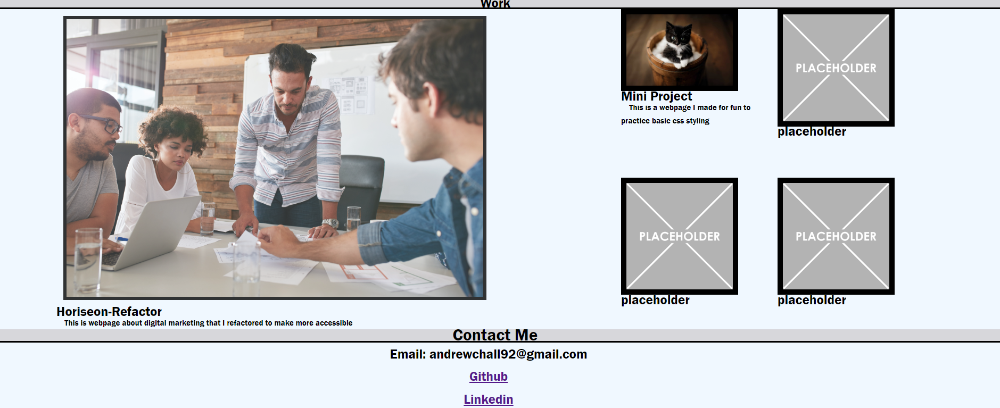

# Portfolio-Andrew Hall

## Description

This is a portfolio showcasing some of my first projects that I have worked on using HTML, CSS, and Git. My main project is a website for online marketing techniques that I refactored to improve its accessibility. I have also included a smaller personal project that I made to practice some basic HTML and CSS styling. The portfolio contains a picture of me and my email in addition to links to my Github and Linkedin accounts. You can also find a downloadable copy of my resume in the navigation bar.
## Features

- Navigation links for ease of use.
- Links to my deployed webpages.
- Contact information.
- Adaptive viewport.

*Preview of my work*

Technology Used         | Resource URL           | 
| ------------- |:-------------:| 
| HTML    | [https://developer.mozilla.org/en-US/docs/Web/HTML](https://developer.mozilla.org/en-US/docs/Web/HTML) | 
| CSS     | [https://developer.mozilla.org/en-US/docs/Web/CSS](https://developer.mozilla.org/en-US/docs/Web/CSS)      |   
| Git | [https://git-scm.com/](https://git-scm.com/)     |    

 [Visit the Deployed Site](https://andrewchall92.github.io/portfolio-andrew-hall/)

## License

This project is licensed under the [MIT License](LICENSE).